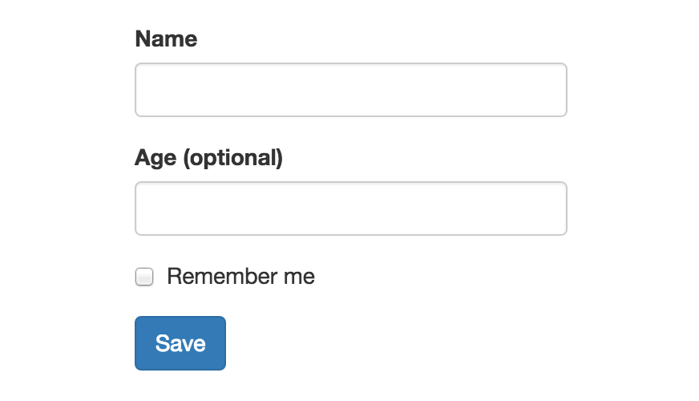

[](https://travis-ci.org/gcanti/tcomb-form)
[](https://david-dm.org/gcanti/tcomb-form)


> "Simplicity is the ultimate sophistication" (Leonardo da Vinci)

# Domain Driven Forms

The [tcomb library](https://github.com/gcanti/tcomb) provides a concise but expressive way to define domain models in JavaScript.

The [tcomb-validation library](https://github.com/gcanti/tcomb-validation) builds on tcomb, providing validation functions for tcomb domain models.

This library builds on those two and **realizes an old dream of mine**.

# Playground

This [playground](https://gcanti.github.io/resources/tcomb-form/playground/playground.html), while a bit outdated, gives you the general idea.

# Benefits

With tcomb-form you simply call `<Form type={Model} />` to generate a form based on that domain model. What does this get you?

1. Write a lot less HTML
2. Usability and accessibility for free (automatic labels, inline validation, etc)
3. No need to update forms when domain model changes

# Flexibility

- tcomb-forms lets you override automatic features or add additional information to forms.
- You often don't want to use your domain model directly for a form. You can easily create a form specific model with tcomb that captures the details of a particular feature, and then define a function that uses that model to process the main domain model.

# Example

```js
import t from 'tcomb-form'

const FormSchema = t.struct({
  name: t.String,         // a required string
  age: t.maybe(t.Number), // an optional number
  rememberMe: t.Boolean   // a boolean
})

const App = React.createClass({

  onSubmit(evt) {
    evt.preventDefault()
    const value = this.refs.form.getValue()
    if (value) {
      console.log(value)
    }
  },

  render() {
    return (
      <form onSubmit={this.onSubmit}>
        <t.form.Form ref="form" type={FormSchema} />
        <div className="form-group">
          <button type="submit" className="btn btn-primary">Save</button>
        </div>
      </form>
    )
  }

})
```

**Output**. Labels are automatically generated.



# Documentation

[GUIDE.md](GUIDE.md)

**Browser compatibility**: same as React >=0.13.0

# Contributions

Thanks so much to [Chris Pearce](https://github.com/Chrisui) for pointing me in the right direction
and for supporting me in the v0.4 rewrite.

Special thanks to [William Lubelski](https://github.com/lubelski) ([@uiwill](https://twitter.com/uiwill)), without him this library would be less magic.

Thanks to [Esa-Matti Suuronen](https://github.com/epeli) for the excellent `humanize()` function.

Thanks to [Andrey Popp](https://github.com/andreypopp) for writing [react-forms](https://github.com/prometheusresearch/react-forms), great inspiration for list management.

# Contributing

[CONTRIBUTING.md](CONTRIBUTING.md)
